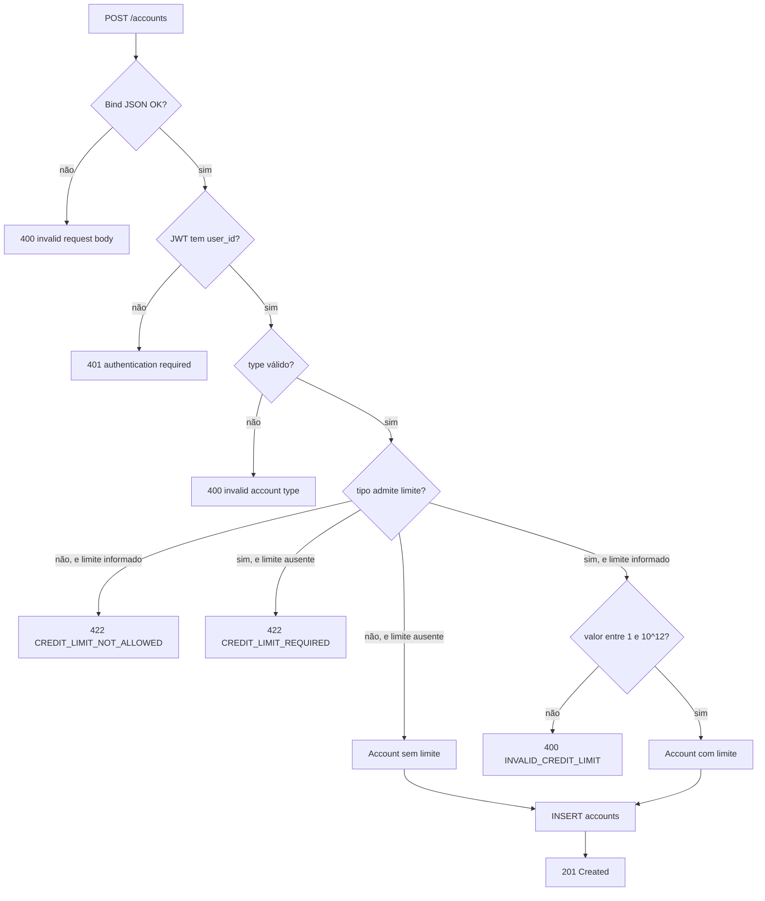
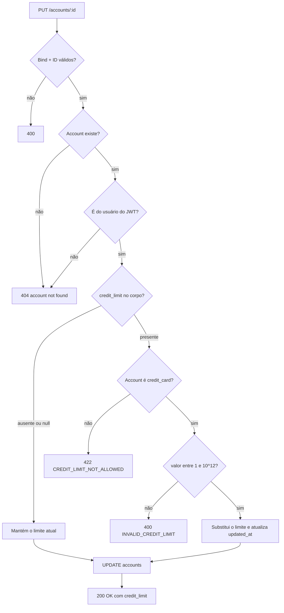
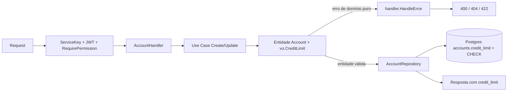

# Account — Limite de Crédito

> Documentação de referência do atributo `credit_limit` da Account. Derivada de
> `specs/features/account-credit-limit.spec.md` (SPEC-account-001).

## Contexto

A Account é o container financeiro do usuário (conta bancária, cartão de crédito ou
dinheiro em espécie) e já carregava o saldo. Faltava o teto: sem limite de crédito, o saldo
devedor de um cartão é um número sem referência — não dá para dizer se R$ 3.000 de fatura é
pouco ou se já comprometeu o cartão inteiro.

O `credit_limit` é um **atributo cadastral**: o usuário informa na criação do cartão e edita
quando quiser. Ele não participa de nenhuma movimentação financeira — não é debitado, não
gera lançamento e não altera saldo. Sua razão de existir é alimentar as consolidações de uso
de crédito (percentual usado e remanescente).

Nenhuma rota nova foi criada: quatro endpoints existentes do domínio account ganharam o
campo.

## Endpoint

O campo aparece nas quatro rotas abaixo, registradas em
`internal/infrastructure/web/router/account.go:12-15`.

| Método | Rota | Papel do `credit_limit` | Permissão |
| ------ | ---- | ----------------------- | --------- |
| `POST` | `/accounts` | Entrada — obrigatório para `credit_card`, proibido nos outros tipos | `account:write` |
| `PUT` | `/accounts/:id` | Entrada (parcial) e saída | `account:update` |
| `GET` | `/accounts/:id` | Saída | `account:read` |
| `GET` | `/accounts` | Saída (em cada item de `data[]`) | `account:read` |

### Headers e credenciais

| Header | Obrigatório | Descrição | Quem resolve |
| ------ | ----------- | --------- | ------------ |
| `Authorization: Bearer <jwt>` | Sim | Identifica o usuário dono da account; o `user_id` do token é usado tanto para gravar o dono quanto para a checagem de posse | `middleware.JWTAuth` |
| `Service-Name` / `Service-Key` | Conforme ambiente | Autenticação serviço-a-serviço; obrigatória quando `SERVICE_KEYS_ENABLED=true` (fail-closed em HML/PRD) | `middleware.ServiceKeyAuth` |
| `Content-Type: application/json` | Sim (POST/PUT) | Corpo da requisição | Gin binding |

Nenhuma permissão nova foi criada — o campo reaproveita as permissões de account já
semeadas pelo RBAC.

### Request Body — `POST /accounts`

Estrutura definida em `internal/usecases/account/dto/create.go:8-17`.

| Campo | Tipo | Obrigatório | Descrição |
| ----- | ---- | ----------- | --------- |
| `name` | string (≤255) | Sim | Nome da account |
| `type` | string | Sim | `bank_account`, `credit_card` ou `cash` |
| `description` | string (≤1000) | Não | Descrição livre |
| `credit_limit` | int64 (centavos) | **Condicional** | Obrigatório quando `type=credit_card`; **proibido** nos demais tipos. Deve ser `> 0` e `<= 1000000000000` (R$ 10 bilhões) |

```json
{
  "name": "Cartão Nubank",
  "type": "credit_card",
  "description": "cartão principal",
  "credit_limit": 500000
}
```

### Request Body — `PUT /accounts/:id`

Estrutura definida em `internal/usecases/account/dto/update.go:8-16`. Atualização parcial:
campo ausente não é alterado.

| Campo | Tipo | Obrigatório | Descrição |
| ----- | ---- | ----------- | --------- |
| `name` | string (≤255) | Não | Novo nome |
| `description` | string (≤1000) | Não | Nova descrição |
| `credit_limit` | int64 (centavos) | Não | Novo limite. **Ausente ou `null` = não alterar.** Aceito apenas quando a account é `credit_card` |

O `type` **não** é atualizável — é o que mantém a invariante tipo × limite sem revalidação
cruzada.

Não existe operação de remoção do limite: cartão sem limite é estado proibido, e os outros
tipos não têm limite para remover. É por isso que "ausente" e "`null`" recebem o mesmo
tratamento — `*int64` não distingue os dois casos, e a regra torna a distinção irrelevante.

### Response Body

`GET /accounts/:id` e os itens de `GET /accounts` usam
`internal/usecases/account/dto/get.go:14-27`; `PUT /accounts/:id` usa
`internal/usecases/account/dto/update.go:19-30`.

| Campo | Tipo | Descrição |
| ----- | ---- | --------- |
| `balance` | int64 | Saldo atual em centavos; negativo em cartão significa fatura em aberto |
| `credit_limit` | int64 \| null | Limite em centavos; `null` quando a account não admite limite |

O campo é serializado como **número inteiro de centavos**, igual ao `balance` — sem
`omitempty`, para que apareça explicitamente como `null` quando ausente.

```json
{
  "data": {
    "id": "019...",
    "user_id": "019...",
    "name": "Cartão Nubank",
    "type": "credit_card",
    "description": "cartão principal",
    "balance": -300000,
    "credit_limit": 500000,
    "active": true,
    "created_at": "2026-08-21T10:00:00Z",
    "updated_at": "2026-08-21T10:00:00Z"
  }
}
```

`POST /accounts` mantém a resposta enxuta de antes (`id` + `created_at`), sem o campo.

## Registro da Rota

Arquivo: `internal/infrastructure/web/router/account.go:11-17`.

```go
func RegisterAccountRoutes(rg *gin.RouterGroup, h *handler.AccountHandler, loader middleware.PermissionLoader) {
	rg.POST("/accounts", middleware.RequirePermission(loader, "account:write"), h.Create)
	rg.GET("/accounts", middleware.RequirePermission(loader, "account:read"), h.List)
	rg.GET("/accounts/:id", middleware.RequirePermission(loader, "account:read"), h.GetByID)
	rg.PUT("/accounts/:id", middleware.RequirePermission(loader, "account:update"), h.Update)
	rg.DELETE("/accounts/:id", middleware.RequirePermission(loader, "account:delete"), h.Delete)
}
```

Ordem dos middlewares, aplicada em `internal/infrastructure/web/router/router.go:138-141`:

1. `middleware.ServiceKeyAuth` — grupo `protected`
2. `middleware.JWTAuth` — subgrupo de accounts
3. `middleware.RequirePermission` — por rota

## Camada de transporte (handler Gin)

Arquivos: `internal/infrastructure/web/handler/account.go:58-87` (Create) e
`internal/infrastructure/web/handler/account.go:191-214` (Update).

Observabilidade: spans `AccountHandler.Create` e `AccountHandler.Update`.

O handler é fino e **não** valida limite de crédito:

1. Faz bind do JSON no DTO de entrada (`ShouldBindJSON`).
2. Em falha de bind — inclusive `credit_limit` fracionário ou textual — responde
   `400 invalid request body`, sem arredondar nem truncar.
3. Extrai o `user_id` do contexto JWT (Create exige; Update usa `ownershipUserID`).
4. Chama o use case.
5. Em erro, delega a tradução HTTP a `handler.HandleError`.
6. Em sucesso, responde com `httpgin.SendSuccess`.

## Camada de negócio (use cases)

Arquivos: `internal/usecases/account/create.go:30-75` e
`internal/usecases/account/update.go:29-94`.

Observabilidade: spans `UseCase.Account.Create` e `UseCase.Account.Update`; recusas de
limite marcam o span com `telemetry.WarnSpan` e o atributo
`app.result="invalid_credit_limit"` — erro esperado, não alerta.

Os use cases **orquestram e não revalidam**: a decisão sobre o limite é sempre da entidade.

- Create (`internal/usecases/account/create.go:54`) repassa `input.CreditLimit` cru para
  `accountdomain.NewAccount`, que decide.
- Update (`internal/usecases/account/update.go:67-74`) só chama
  `a.SetCreditLimit(*input.CreditLimit)` quando o ponteiro é não-nulo — é como "ausente ou
  null = não alterar" é implementado.
- A conversão do limite de domínio para o ponteiro de centavos dos DTOs fica em
  `internal/usecases/account/mapper.go:10-16`.

## Camada de domínio (entidade e value object)

O limite é guardado por duas peças com responsabilidades distintas:

| Peça | Arquivo | Responsabilidade |
| ---- | ------- | ---------------- |
| `vo.CreditLimit` | `internal/domain/account/vo/credit_limit.go:15-54` | Guardião do **valor**: `> 0` e `<= MaxCreditLimit`. Implementa `driver.Valuer` e `sql.Scanner` |
| `MaxCreditLimit` | `internal/domain/account/vo/credit_limit.go:11` | Teto de R$ 10 bilhões — barra input absurdo e mantém a soma dos limites dentro de `int64` |
| `Account.CreditLimit` | `internal/domain/account/entity.go:27` | Ponteiro: ausência é estado legítimo, e o zero-value do VO é inválido |
| `AcceptsCreditLimit` | `internal/domain/account/entity.go:32-34` | Fonte única de "quais tipos admitem limite" |
| `NewAccount` | `internal/domain/account/entity.go:40-63` | Retorna `(*Account, error)` — não é possível construir entidade inválida |
| `SetCreditLimit` | `internal/domain/account/entity.go:68-81` | Substitui o limite; recusa tipo incompatível e valor fora da faixa |
| `resolveCreditLimit` | `internal/domain/account/entity.go:87-104` | Aplica as invariantes **na ordem certa** |

A invariante cruzada (tipo × limite) mora na **entidade**, não no VO — que não conhece o
tipo da conta — nem no use case: "cartão tem teto, dinheiro em espécie não" é regra
corporativa.

**A ordem das invariantes é significativa.** `resolveCreditLimit` avalia presença × tipo
antes do valor, para que um limite informado num tipo que não o admite seja recusado como
`ErrCreditLimitNotAllowed` **mesmo quando o valor é zero ou negativo**. Invertida, a ordem
produziria `400 invalid credit limit` em vez do `422` correto para
`{"type":"cash","credit_limit":0}`.

## Fluxo 1 — Criação de account com limite

Ativado em `POST /accounts`.

| # | Passo | Onde |
| - | ----- | ---- |
| 1 | Bind do JSON; valor não inteiro morre aqui com `400` | `internal/infrastructure/web/handler/account.go:63-66` |
| 2 | `user_id` extraído do JWT | `internal/infrastructure/web/handler/account.go:70-75` |
| 3 | Parse do `user_id` e do `type` | `internal/usecases/account/create.go:37-51` |
| 4 | Entidade decide sobre o limite (presença × tipo, depois valor) | `internal/domain/account/entity.go:87-104` |
| 5 | Persistência com `credit_limit` na coluna (ou `NULL`) | `internal/infrastructure/db/postgres/repository/account.go:97-109` |
| 6 | Resposta `201` com `id` + `created_at` | `internal/infrastructure/web/handler/account.go:86` |



## Fluxo 2 — Alteração do limite

Ativado em `PUT /accounts/:id` quando `credit_limit` vem no corpo com valor não nulo.

| # | Passo | Onde |
| - | ----- | ---- |
| 1 | Bind do JSON e parse do ID | `internal/usecases/account/update.go:35-41` |
| 2 | Busca a account | `internal/usecases/account/update.go:45-49` |
| 3 | Checagem de posse — não-dono recebe `404`, sem oráculo de existência | `internal/usecases/account/update.go:52-57` |
| 4 | Aplica name/description quando presentes | `internal/usecases/account/update.go:59-64` |
| 5 | Se `credit_limit` não é nulo, a entidade substitui o limite | `internal/usecases/account/update.go:67-74` |
| 6 | `UPDATE` grava `credit_limit` e `updated_at`; **não toca `balance`** | `internal/infrastructure/db/postgres/repository/account.go:252-279` |
| 7 | Resposta `200` com o limite vigente | `internal/usecases/account/update.go:84-93` |

Reduzir o limite abaixo do saldo devedor **é permitido**: limite é dado cadastral, e travar a
edição impediria corrigir um valor digitado errado antes de pagar a fatura. A consequência é
o estado de *overlimit*, que a consolidação representa sem saturar — percentual acima de 100%
e disponível negativo.



## Visão Geral (Alto Nível)



## Cenários de Erro

Tradução centralizada em `internal/infrastructure/web/handler/error.go:77-79`, o mesmo mapa
que popula `apperror.DomainSentinels` — é o que faz esses erros serem classificados como
**esperados** na telemetria.

| HTTP | Código | Cenário | Descrição |
| ---- | ------ | ------- | --------- |
| 422 | `CREDIT_LIMIT_REQUIRED` | `credit_card` criado sem limite | `credit limit is required for credit card accounts` |
| 422 | `CREDIT_LIMIT_NOT_ALLOWED` | Limite informado em `bank_account` ou `cash`, na criação ou na atualização — inclusive valor zero | `credit limit is only allowed for credit card accounts` |
| 400 | `INVALID_CREDIT_LIMIT` | Limite `<= 0` ou acima de `1000000000000` | `credit limit must be greater than zero and at most 1000000000000 cents` |
| 400 | — | Limite fracionário, textual ou booleano; barrado no bind, sem arredondar | `invalid request body` |
| 404 | `ACCOUNT_NOT_FOUND` | Account inexistente **ou** de outro usuário — os dois casos são indistinguíveis de propósito | `account not found` |
| 401 | — | JWT ausente, expirado ou inválido | `authentication required` |
| 403 | — | Falta `account:write` ou `account:update` | Resposta do `RequirePermission` |
| 500 | — | Falha de persistência; mensagem sanitizada, sem SQL nem stack | `internal server error` |

O critério dos status: **400** para valor malformado em si (alinhado a `ErrInvalidAmount` e
`ErrInvalidID`, já 400 no projeto); **422** para regra que depende do **estado** da entidade
— a combinação tipo × limite (alinhado a `ErrAccountNotActive`, já 422).

## Outras Responsabilidades

| Responsabilidade | Momento | Descrição |
| ---------------- | ------- | --------- |
| Migração de esquema | Deploy | `internal/infrastructure/db/postgres/migration/20260823232448_add_credit_limit_to_accounts.sql` adiciona `credit_limit BIGINT NULL` e a constraint `accounts_credit_limit_type_check`. Sem backfill: se existir `credit_card` sem limite, a migration **falha de propósito** em vez de inventar um valor financeiro |
| Defesa em profundidade no banco | Toda escrita | A `CHECK` recusa cartão sem limite, limite em tipo que não o admite e valor fora da faixa — inclusive escrita feita por fora da aplicação. É rede de segurança, não a validação primária |
| Mapeamento NULL ↔ ausência | Leitura e escrita | `accountDB.CreditLimit *int64` (`internal/infrastructure/db/postgres/repository/account.go:31`) preserva a diferença entre "sem limite" e "limite zero", sem sentinela mágica |
| Integridade do saldo | Alteração de limite | Nenhum caminho de limite escreve em `balance` nem cria statement; o `UPDATE` toca apenas `credit_limit` e `updated_at` |
| Observabilidade | Recusas | `telemetry.WarnSpan` + `app.result="invalid_credit_limit"` no use case — span segue `Ok`, sem alertar |
| Leitura pela consolidação | Consulta do dashboard | O bloco `creditUsage` de `SPEC-dashboard-001` lê o limite vigente da account (snapshot), sem histórico |

## Fora de escopo

Comportamentos que este atributo **não** implementa, por decisão registrada na spec:

- Bloqueio de lançamento por limite — `POST` de statement, importação OFX e estorno seguem
  aceitando débito que ultrapasse o limite.
- Histórico ou auditoria das alterações de limite.
- Limite de cheque especial para `bank_account`.
- Fatura: fechamento, vencimento, juros, parcelamento, pagamento mínimo.
- Filtro, ordenação ou busca por `credit_limit` nas listagens.
- Alteração do `type` de uma account existente.
- Alertas de proximidade do limite.
- Multi-moeda — o valor é centavos da moeda única implícita.

## Controle de Versão do Documento

| Versão | Data | Autor | Descrição |
| ------ | ---- | ----- | --------- |
| 1.0 | 2026-08-23 | Denyson Grellert | Documentação inicial do `credit_limit`, derivada de SPEC-account-001 |
